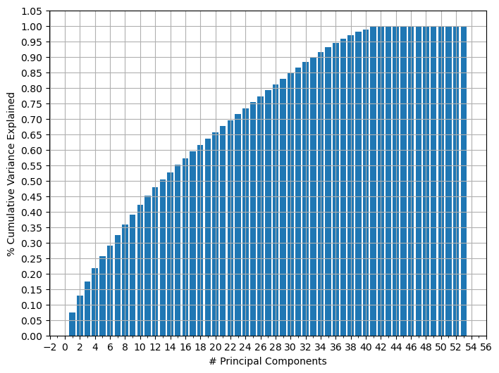
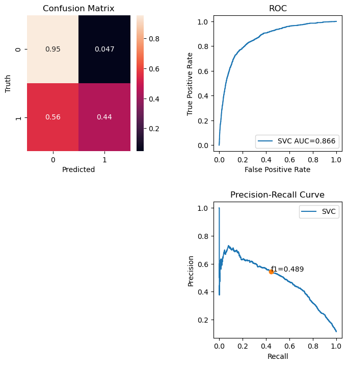
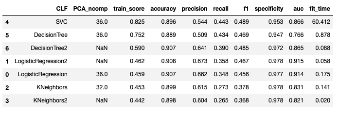
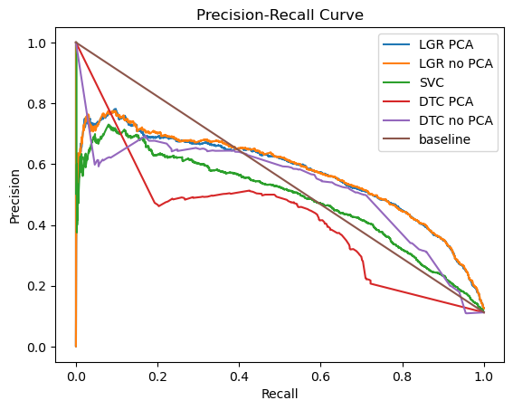
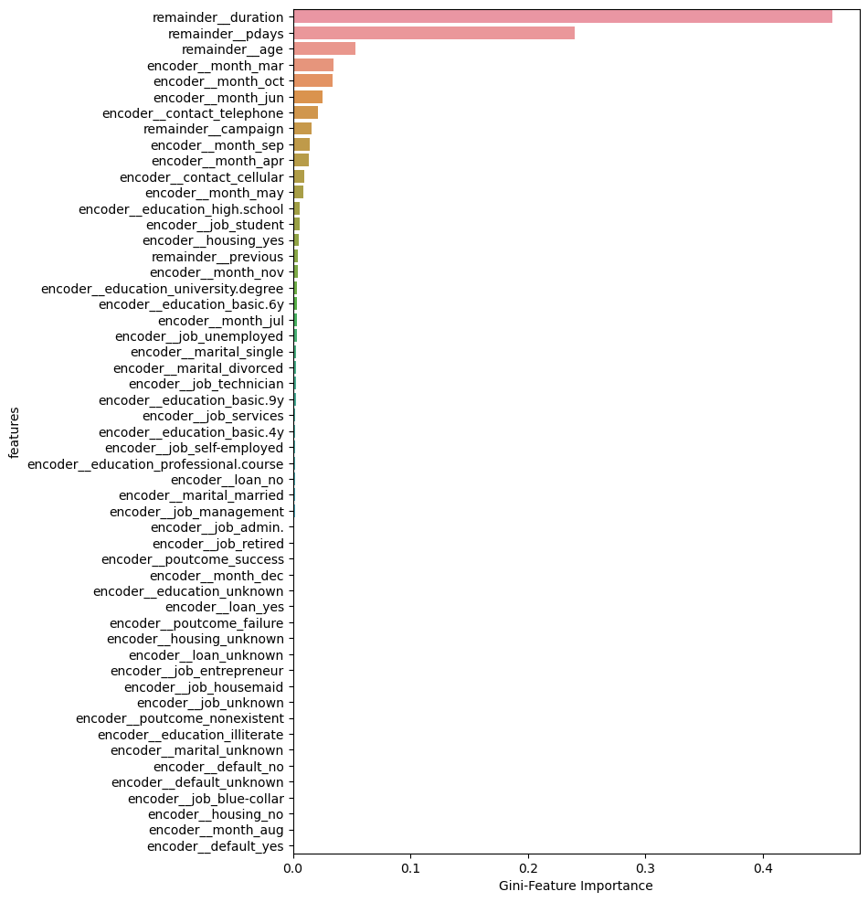

# Practical_Application_Assignment_17.1

**Business Objectives:**

Direct marketing campaigns are an inexpensive means to increase sales; however, the performance of direct phone marketing is largely unknown. 

The first objective is to build multiple classifier methods that will predict whether a customer contact over the phone will result in a sale of banking deposit products. The features used to train the classifier methods is from a Portugal dataset used in a previous study by Moro and Laureano. The goal is to examine the performance of multiple classifier methods based on a set of metrics.

The metrics used in this study is based two types of errors. There is a low cost or penalty for type-I errors i.e., false alarms. In this case we're targeting customers with phone calls who are likely to already purchase banking products.  This is inefficient and maximizing precision will reduce costs and being a nuisance to buying customers.  Type-II errors or missed detections is more detrimental due to missing sales opportunities. Here we wish to maximize recall score. Since there is a large class imbalance (target label percentages: 11% 1="sale" versus 89% 0="no sale"), accuracy score is not the best metric given that most of the feature space is of the class 0(label='no sale'), i.e., good at predicting majority of false-positives but not minority of true-positives. We therefore optimize for maximum f1-score (a combination of recall and precision) but ultimately also want to pick methods that optimize recall in addition to other metrics.

Besides comparing the performance of the classifiers, we also wish to analyze the importance of the features and provide some interpretation so to improve the efficiency for future direct marketing methods.

**Data Exploration and Feature Engineering:**

Correlation analysis indicates that duration, pdays, previous, emp.var.rate, euribor3m, and nr.employment correlates highest with target variable. 

**Features:**

<code>
features = ['age', 'job', 'marital', 'education', 'default', 'housing', 'loan', 'contact', 
            'month', 'duration', 'campaign', 'pdays', 'previous', 'poutcome' ]
</code>

**List of features including onehotencoding**
<code>
       'encoder__job_admin.', 'encoder__job_blue-collar',
       'encoder__job_entrepreneur', 'encoder__job_housemaid',
       'encoder__job_management', 'encoder__job_retired',
       'encoder__job_self-employed', 'encoder__job_services',
       'encoder__job_student', 'encoder__job_technician',
       'encoder__job_unemployed', 'encoder__job_unknown',
       'encoder__marital_divorced', 'encoder__marital_married',
       'encoder__marital_single', 'encoder__marital_unknown',
       'encoder__education_basic.4y', 'encoder__education_basic.6y',
       'encoder__education_basic.9y', 'encoder__education_high.school',
       'encoder__education_illiterate',
       'encoder__education_professional.course',
       'encoder__education_university.degree', 'encoder__education_unknown',
       'encoder__default_no', 'encoder__default_unknown',
       'encoder__default_yes', 'encoder__housing_no',
       'encoder__housing_unknown', 'encoder__housing_yes', 'encoder__loan_no',
       'encoder__loan_unknown', 'encoder__loan_yes',
       'encoder__contact_cellular', 'encoder__contact_telephone',
       'encoder__month_apr', 'encoder__month_aug', 'encoder__month_dec',
       'encoder__month_jul', 'encoder__month_jun', 'encoder__month_mar',
       'encoder__month_may', 'encoder__month_nov', 'encoder__month_oct',
       'encoder__month_sep', 'encoder__poutcome_failure',
       'encoder__poutcome_nonexistent', 'encoder__poutcome_success',
       'remainder__age', 'remainder__duration', 'remainder__campaign',
       'remainder__pdays', 'remainder__previous'
</code>

Cumulative Variance Explained versus principal components. 

Given that there are 53 features we use PCA do see if we can reduce the number of dimensions. The features are scaled by the mean and standard deviations. Based on the cumulative variance explained for all 53 principal components, we decided to grid search over 24, 32, 36 number of principal components to capture at least 75% to 95% of all the variance in the features. The significance, here is that we reduce the run time for training the classification models by using at least 17 fewer features.  As a test using some of the faster classifier models (not SVM), we also consider all original 53 untransformed features.

Figure above shows the confusion matrix, ROC curve, and Precision-Recall curve with optimal SVM Classifier. 

**Table of scores**

**Findings:**

1. PCA reduced the number of features needed to train classifiers mainly reducing the number of non-important features by about 17 (53 to 36). The percent cumulative variance explanation was 95% with number of principal components at 36. 

2. SVM and Decision Tree Classifier performed the best f1-score (see figure above and Table with scores). SVM took about 50 times slower than Decision Tree Classifier. 

3. We used the GridsearchCV for the best hyperparameters. These were used with the Decision Tree Classifier to estimate the Gini-feature Importance for the 53 features.  We find that the feature importance is the highest for the duration of the phone marketing calls, the number of days previous contact, and age. The months also factor in with March, October and June being most important. This is similar finding with the Moro and Laureano paper. 

Above is the DecisionTreeClassifier Gini-Feature importance as a function of the features. 

**Future work:**
1. The next step is to examine the thresholds which here are assumed to be probability of 0.5. 
2. We also did not use the social economic variables given that they would not be available for future predictions.  However, it would be interesting to included them to see if they give any improvement in the classifiers.

